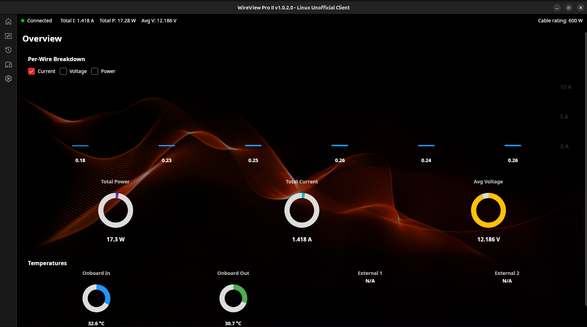

# WireView Pro II - Linux Unofficial Client

Unofficial Linux port of the [Thermal Grizzly WireView Pro II](https://www.thermal-grizzly.com/en/wireview-pro-ii-gpu/s-tg-wv-p2) desktop application. Built with .NET 8.0 and [Avalonia UI](https://avaloniaui.net/).

> A **Windows** build (**WireView Plus**) is also available on the [Releases](https://github.com/emaspa/wireview-linux/releases) page - see [Windows](#windows-x64) under Installation.



## Features

- **Real-time monitoring** - Voltage, current, and power readings across all 6 pins with live charts, plus custom charts: pick any telemetry series, per-series colors, manual or auto Y scaling
- **Device configuration** - Fan speed, display settings, fault alarms, thresholds
- **Configuration profiles** - Save, load, and manage named device configurations
- **Data logging** - On-device log readback and CSV export, browsable per power cycle
- **Desktop notifications** - Via `notify-send`
- **Software shutdown on fault** - Optional system shutdown when a fault alarm triggers, for eGPU or setups where the hardware shutdown header cannot be connected
- **LAN monitoring** - Read WireViews on other machines over the network, optionally publish this host's device, and remotely view/edit a remote device's configuration (HMAC-authenticated). See [LAN monitoring](#lan-monitoring) below
- **Theme editor** - Customize the device display: background images, text and highlight colors, display inversion, with a live preview. Theme files (.wv2t) are compatible with the official Windows app
- **Firmware updates** - Flash the bundled firmware (currently v05) from the Device page over USB DFU. Requires the `dfu-util` package; shows the bundled vs. device firmware version and warns before downgrades

> **Warning:** firmware flashing restarts the device into its STM32 bootloader and rewrites its flash. It follows the same DFU procedure as the official Windows client (and refuses to start if `dfu-util` or the firmware image is missing), but a power loss or unplug mid-flash can leave the device unbootable until reflashed manually. This is unofficial software, not affiliated with or endorsed by Thermal Grizzly: flash at your own risk. The previous experimental `dfu-enabled` branch has been removed in favor of this built-in implementation.

> **hwmon integration**: If you want sensor data exposed to `sensors`, Grafana, conky, btop, and other monitoring tools via `/sys/class/hwmon/`, see [wireview-hwmon](https://github.com/emaspa/wireview-hwmon). The kernel module and daemon work standalone without this app, and this app can also use them as an alternative to direct serial communication (see below). That project also includes `wireviewctl`, a CLI tool for monitoring and scripting device commands from the terminal.

## Connection modes

The app supports two ways of communicating with the device:

| Mode | How it works | Features |
|------|-------------|----------|
| **Direct serial** | App talks to the device over `/dev/ttyACM*` | Full control (default) |
| **hwmon + daemon** | App reads sensors from `/sys/class/hwmon/`, sends commands via the [wireviewd](https://github.com/emaspa/wireview-hwmon) daemon socket | Full control, plus sensor data available to system monitoring tools |

The app auto-detects the connection mode at startup. If the [wireview-hwmon](https://github.com/emaspa/wireview-hwmon) kernel module is loaded, the app uses hwmon for sensor data and connects to the daemon's Unix socket (`/run/wireviewd.sock`) for commands - configuration read/write, fault clearing, screen control, and device info all work through the daemon. If the daemon is not running, the app still displays sensor data in read-only mode.

If the kernel module is not loaded, the app falls back to direct serial communication automatically.

## LAN monitoring

Beyond the single local device, the app can monitor and control **WireViews on
other machines** over the LAN - one desktop reading several servers, or two PCs
watching each other.

### Reading remote devices

In **Settings → Remote hosts**, add a comma-separated list of hosts
(`192.168.1.50`, or `host:port` for a custom port - default `9876`). Each remote
device appears in the device picker as `lan @ host` alongside local ones, with
full live monitoring. A remote host is typically the
[wireviewd](https://github.com/emaspa/wireview-hwmon) daemon (Linux/Unraid) or
another copy of this app with publishing enabled (Windows/macOS).

### Publishing this host (Windows / macOS)

**Settings → Publish this host on the LAN** opens a listener (default port
`9876`, configurable) so other instances can read this machine's device. **Off
by default.** On Linux the `wireviewd` daemon owns publishing, so the toggle is
hidden there.

### Remote control & configuration (authenticated)

Set the same **Network secret** on the publisher and the reader to allow
*writing* to a remote device - screen changes, NVM store/reset, clear-faults,
and the full configuration editor all work against a remote device. Requests are
signed with HMAC-SHA256 (the secret never crosses the wire; replays rejected).
Reading a remote needs no secret; only writes do, and failures are surfaced
precisely (e.g. *"set the network secret"*, *"rejected by the remote host"*,
*"the remote host is unreachable"*).

> Publishing is independent of reading - you can read remote hosts without
> exposing your own. There is no TLS; this targets a trusted LAN.

## Requirements

- Linux with USB support (tested on Ubuntu 24.04 / 26.04 LTS, Fedora 42-44, and Arch Linux; also packaged for Arch-based distros via the AUR and immutable distros like Bazzite / Silverblue via Flatpak)
- A Thermal Grizzly WireView Pro II device connected via USB
- Optional: `dfu-util` for in-app firmware flashing (the Flatpak bundles it; deb/rpm/AUR packages list it as a recommended/optional dependency)

## Installation

### Windows (x64)

A self-contained Windows build, **WireView Plus**, is published on the [Releases](https://github.com/emaspa/wireview-linux/releases) page (`wireview-plus-<version>-windows-x64.zip`). Extract it and run the executable - no installation or .NET runtime required.

### Ubuntu 24.04 / 26.04 LTS (PPA)

```bash
sudo add-apt-repository ppa:sparvoli/wireview-hwmon
sudo apt update
sudo apt install wireview-linux
```

To also install the hwmon kernel module and daemon for system-wide sensor integration:

```bash
sudo apt install wireview-hwmon wireview-hwmon-dkms
```

### Ubuntu / Debian (.deb package)

A pre-built `.deb` package is available on the [Releases](https://github.com/emaspa/wireview-linux/releases) page. Download it and install:

```bash
sudo apt install ./wireview-linux_*_amd64.deb
```

### Fedora (COPR)

```bash
sudo dnf copr enable emaspa/wireview-linux
sudo dnf install wireview-linux
```

Or grab the standalone `.rpm` from the [Releases](https://github.com/emaspa/wireview-linux/releases) page - a single RPM works on all current Fedora releases (tested on 42, 43, and 44):

```bash
sudo dnf install ./wireview-linux-*.x86_64.rpm
```

To also install the hwmon kernel module and daemon for system-wide sensor integration (same COPR repo):

```bash
sudo dnf install wireview-hwmon wireview-hwmon-dkms
```

The package is a self-contained binary - no .NET runtime is required. For immutable, atomic distros (Bazzite, Silverblue, Kinoite), use the Flatpak below instead.

### Flatpak (Bazzite / Silverblue / immutable distros)

A `.flatpak` bundle is available on the [Releases](https://github.com/emaspa/wireview-linux/releases) page:

```bash
flatpak install ./wireview-linux-*.flatpak
flatpak run io.github.emaspa.WireViewLinux
```

The Flatpak supports direct USB serial mode. A sandbox cannot install udev rules, so install the rule on the host once:

```bash
sudo curl -fsSL https://raw.githubusercontent.com/emaspa/wireview-linux/main/udev/99-wireview.rules \
  -o /etc/udev/rules.d/99-wireview.rules
sudo udevadm control --reload-rules && sudo udevadm trigger
```

### Arch Linux / CachyOS / EndeavourOS (AUR)

[`wireview-linux-bin`](https://aur.archlinux.org/packages/wireview-linux-bin) installs the pre-built release binary (no .NET SDK, no compile) and tracks the latest release:

```bash
paru -S wireview-linux-bin   # or: yay -S wireview-linux-bin
```

A community source package, [`wireview-linux`](https://aur.archlinux.org/packages/wireview-linux) (maintained by arakmar), builds from source instead - note it may lag behind the latest release:

```bash
paru -S wireview-linux
```

To also install the hwmon kernel module and daemon for system-wide sensor integration:

```bash
paru -S wireview-hwmon wireview-hwmon-dkms
```

### Serial access (package installs)

The package installs above (PPA, `.deb`, `.rpm`, AUR) install the udev rule and
the system reloads it automatically, so **serial access works out of the box** -
the rule grants the device node access directly (`MODE="0666"` plus a logind
`uaccess` ACL for the active session), with no group membership or logout
required.

If access still fails in an unusual setup (for example over SSH, where the
`uaccess` ACL doesn't apply), add yourself to the `dialout` group and log back
in:

```bash
sudo usermod -aG dialout "$USER"
```

### Option 1: Pre-built binary (no .NET required)

The tarball is self-contained: the app binary, the udev rule, and a one-time
`install.sh` that sets up USB serial access.

```bash
# Download and extract the latest release
curl -sL $(curl -s https://api.github.com/repos/emaspa/wireview-linux/releases/latest | grep -o 'https://.*linux-x64.tar.gz') | tar xz
cd wireview-linux-*-linux-x64

# One-time USB serial setup (installs the udev rule)
./install.sh

# Run
./WireView2
```

### Option 2: Build from source

Requires [.NET 8.0 SDK](https://dotnet.microsoft.com/download/dotnet/8.0) or later.

```bash
git clone https://github.com/emaspa/wireview-linux.git
cd wireview-linux
sudo ./install.sh
```

The install script will:
1. Install udev rules for automatic USB device permissions
2. Add your user to the `dialout` and `plugdev` groups
3. Build the application

**You must log out and back in** for the group changes to take effect.

Or manually step by step:

```bash
git clone https://github.com/emaspa/wireview-linux.git
cd wireview-linux

# Install udev rules (grants access to the WireView USB device)
sudo cp udev/99-wireview.rules /etc/udev/rules.d/
sudo udevadm control --reload-rules
sudo udevadm trigger

# Add yourself to the required groups
sudo usermod -aG dialout $USER
sudo usermod -aG plugdev $USER

# Log out and back in, then build and run
dotnet build -c Release
dotnet run --project WireView2/ -c Release
```

### Quick permissions fix (no reboot)

If you just want to test without logging out:

```bash
sudo chmod 666 /dev/ttyACM0
```

This is temporary and resets when the device is unplugged.

## Usage

The app has five pages accessible from the left sidebar:

| Page | Description |
|------|-------------|
| **Overview** | Summary of total current, power, voltage, cable rating, and a fault status/log table with per-fault clear |
| **Monitoring** | Real-time charts for voltage, current, power, and temperature; custom series selection, colors, and Y scaling |
| **Logging** | Read device logs per power cycle and export to CSV |
| **Device** | Device info, full device configuration (fan, display, alarms, thresholds), display theme editor, and firmware updates |
| **Settings** | App theme, startup behavior, background, and LAN settings (remote hosts, publish toggle/port, network secret, log retention) |

### Configuration profiles

On the **Device** page, you can save the current device configuration as a named profile and load it later. Profiles are stored as JSON files in `~/.local/share/PowerMonitor/profiles/`.

## USB device IDs

| Mode | VID | PID | Description |
|------|-----|-----|-------------|
| Normal | `0483` | `5740` | STM32 CDC/ACM virtual serial port |
| DFU bootloader | `0483` | `df11` | STM32 bootloader (during firmware updates) |

## Project structure

```
wireview-linux/
├── WireView2/                  # Main Avalonia UI application
│   ├── Views/                  # AXAML views
│   ├── ViewModels/             # MVVM view models
│   ├── Services/               # App settings, profiles, notifications
│   └── Assets/                 # Icons, backgrounds
├── WireViewDeviceLib/          # Device communication library
│   └── Device/                 # Serial + hwmon + network devices, port finder
├── WireViewNet/                # LAN layer - /sensors publisher, remote device client, HMAC auth
├── udev/                       # udev rules for USB permissions
└── install.sh                  # Installation script
```

## Tech stack

- **.NET 8.0** - Runtime and build system
- **Avalonia UI 12.0** - Cross-platform MVVM UI framework
- **CommunityToolkit.Mvvm 8.4** - MVVM source generators
- **Custom chart controls** - Lightweight line/gauge/bar charts drawn directly with Avalonia (no charting dependency)
- **System.IO.Ports** - Serial communication with the device

## Troubleshooting

### Device not detected

1. Check that the device is connected: `lsusb | grep 0483`
2. Check that `/dev/ttyACM0` exists: `ls -la /dev/ttyACM*`
3. Check permissions: `groups` should include `dialout`
4. If using a VM, ensure USB passthrough is configured for the VID/PID pair

### Permission denied on /dev/ttyACM0

```bash
# Temporary fix:
sudo chmod 666 /dev/ttyACM0

# Permanent fix:
sudo cp udev/99-wireview.rules /etc/udev/rules.d/
sudo udevadm control --reload-rules
sudo udevadm trigger
sudo usermod -aG dialout $USER
# Then log out and back in
```

## Disclaimer

This software is an unofficial, community-made Linux port of the WireView Pro II application. It is **not affiliated with, endorsed by, or supported by Thermal Grizzly or ElmorLabs**. All trademarks belong to their respective owners.

Use at your own risk. This software interacts with hardware, while every effort has been made to ensure correctness, the authors are not responsible for any damage to your device.

## License

This project contains code decompiled from the original WireView Pro II Windows application and code from the [WireViewDeviceLib](https://github.com/ElmorLabs-ThermalGrizzly/WireViewDeviceLib) repository. Please respect the original authors' rights. This port is provided for personal use and interoperability purposes.
